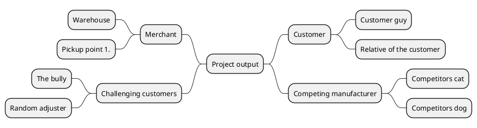
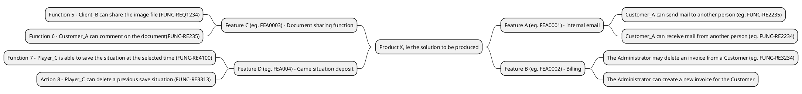
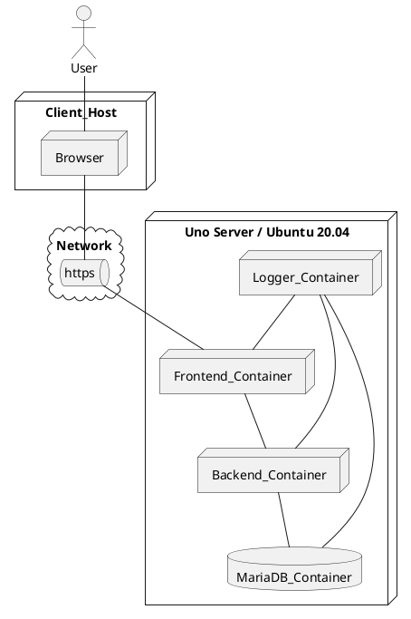

# Short Requirement Specification (template)

|  |  |
|:-:|:-:|
| Document Type | Short Requirement specification |
| Author | *name* |
| Version | *?.0* |
| Date | 1.x.202y |

>Some hints for the author of the specification! All support videos are moved to excercise description page. Please go through materia if you are stuck. As the work progresses, delete the various instruction texts and replace the example images/video links given by template document. Update information in the tables according information related to the case study assignment. Don't change the captioning drastically, but you can remove the extra nonsense and video links :) 
If you are wondering what was original text in document you can allways find the latest version of short-requirement-specification from [this address](https://jamkit.pages.labranet.jamk.fi/project-templates/en-opf-2021-core-template-v2/20-Requirement-management/short-requirement-specification/)
>Br,
>Teachers

## Introduction


>*Let's describe briefly the product/service/software solution, a little background and essentially related things? If you are doing exercise please check if you can use existing stakeholders real names! Otherwise, all names will be changed to self-invented pseudo names*

## Focus Group 


>*For whom is the solution / service being developed for? It is worth of briefly highlight the potential end users and the relevant stakeholders who will benefit or have interest on the service*

* Focus Group A
* Focus Group B
* Focus Group C

## Stakeholder map

>*Using a stakeholder map, we can describe what kind of user, stakeholders or other actors are essentially involved with the planned solution/service? All identified stakeholders are depicted as the form of a stakeholder map. The motivation of the stakeholder/actor for solution should also shown in map presentation. The stakeholder map can be created by using different drawing tools like Drawio or PowerPoint. The MindMap format is very handy way to create a map. Try out integrated PlantUML generator. (Recommended option)*

**Storys from the field**

>*When developing a service, it is necessary to find out some background information and understanding of solution domain,  the industry itself or the operating environment considered. This requires information gathering. It is worth af listening the customer and focus groups to understand better ther purpose of product.. The good information source from end user perspective is valuable for service developer.* 
>*Check out the PlantUML tool mentioned earlier and try creating a stakeholder map related to the product. Instructions can be found at [http://plantuml.com/](http://plantuml.com/). Note that because of integratio of PlantUML with Gitlab, the tags @startuml / @enduml-ig notation are using different notation:*

* instead of @startuml use *```plantuml*
* Instead of @enduml use *```*

>The stakeholder description below can be overwritten to see how the chart can be generated using PlantUML.




## Selected stakeholder profiles


>The stakeholder map provides an overview of the different actors (actor) that are essentially related to the solution / service. If we take a closer look at different end users of the service, for example, we can see that there are clear differences between them.
Due to this, the description has to be refined and specified and, if necessary, the so-called profile description. This description can be used to more accurately identify the nature of the target group. If necessary, a profile-specific description file can be created to provide a more detailed description. This file can be created by copying the bottom profile description and naming it according to the profile. Detailed descriptions are created as needed. The table below presents a few example profiles and the necessary information can be found in the table.

| ID |  Short name | Description | Motivaatio |
|:-:|:-:|:-:|:-:|
| SR-001 | [Customer profile A](templates/template-profile.md) | Teenager 13-17 Years | Primary user of service, multiple reasons for use? |
| SR-002 | [Customer profile B](templates/template-profile.md) | Adult 22-45 Years |  Occassional need for service  |
| SR-003 | [Stakeholder - Investor]() | Investor | Profits from service |
| SR-004 | [Stakeholder - Tax Collector]() | Tax man | Collect taxes |

## Customer journey paths related to the service

>Consider the assignment and consider whether its use involves any general events, for example before or after use. How is the service / solution implemented and how is it used as part of the service paths?
>Case description describes a series of events that are performed in a selected situation during the use of the service. There may be several different customer-specific service paths, but the most important thing is to identify the most important ones at the beginning.
>Sim can be used to describe the service path. A Swim Lane or State Machine Diagram or other method deemed appropriate. The key is to describe the path and use it to clarify the understanding of the service sought.
>*Different descriptions are made to achieve a common understanding, not just to the delight of an individual developer*

**A small story**

>*Think about how different people will be selected as users of Play Station/Steam/XBOX/Nintendo gaming systems? What are the criteria for choosing a personal service? Are there clear differences between user groups? What kind of games do these groups appreciate? How does joining the service work in practice? Where can I find a VISA card? Change in your mind the age of the person and you will find that the so-called. customer journey path varies by age! This Is Very Important To Perceive In A Timely Matter As The Service Developer Needs To Consider Different Potential Customers.*

**customer journey path PlantUML example as a state machine**

>What is customer journey path? Do some googling and you will find several examples. 
Try then to sketch an example of journey path using the PlantUML tool. Study first case study assignment and use it as a origin for path. 


**Path description for customer arriving at a retail store and how general data protection issues are affecting on sales process**

>In this path, one can consider how the customer's decision can be confirmed?

```plantuml
Step1: A description of the service is displayed on the ad screen in the street side window of retail store
Step2: The customer enters the store
Step3: The customer locates a product from the shelf
Step4: The customer asks the salesperson for more information about a product
Step5: The salesperson introduces the product briefly
Step6: The customer does some extra googling about a product
Step7: The customer is ready for accept a product and is ready to buy it
Step8: The customer informs the salesperson and they start to create a contract
Step9: The salesperson recommends also some additional services
Step10: The salesperson asks for the customer’s email address and personal Id number (HETU)
Step11: Because of personal security reasons the customer refuses to hand over personal Id (HETU)
Step12: The salesperson cannot continue with contracting because the customer is not giving needed information.
Step13: The customer leaves the store and a product remains in store

[*] --> Step1
Step1 --> Step2
Step2 --> Step3
Step3 --> Step6
Step3 --> Step4
Step4 --> Step5
Step5 --> Step6
Step6 --> Step7
Step6 --> Step8
Step9 --> Step6
Step8 --> Step12
Step7 --> Step9
Step9 --> Step10
Step10 --> Step11
Step11 --> Step12
Step12 --> Step13
```

## Primary Features

>Next, consider what are the main functional features of the service? At this point, record them in French lines and create an outline based on them in the form of a MindMap description. The image should allow a clearer picture of the different aspects of the service.
>* Consider, for example, a situation where you are asked what you can do with a service you have developed in practice? You will have 15 seconds to respond. What do you answer?
>* What features do you highlight?
>* Why is your product better than others?


**Features and Functions**

| Feature | Functinality |
|:-:|:-:|
| *Functional Feature A - Internal Email* ||
|| Customer_A can send mail to an outsider |
|| Customer_A can receive mail from an internal user of the service |
| *Feature B - Billing* | |
|| Maintenance_person can delete the invoice from the Customer |
|| Maintenance_person can create a new invoice for the Customer |
| *Feature C - game situation deposit* ||
|| Player_B is able to save the situation |
|| Customer_B can add a new person to the Customer_A group |
| *Feature D - direct dial* ||
|| Customer_A can call a friend they know |

**Example in MindMap format and links related functions**




# Functional Requirements

>As you noticed there is concept of a *function* which is mainly related to some *feature*. All software functions can be presented and describes as a *functional requirements*.
It can be generally said that all functions of software can be initially recorded as functional requirement, but in practice some of them turn out to be broader than jus t a function, eg. *Feature*. When gathering and idefining functional requirements, they can be recorded as the form of a table. When documenting a requirements the following conditions should be considered:

* *Requirement must a unique an identified*
* *Requirement must be measurable*
* *The requirement must be unambiguous and clear*
* *The requirement should not include more than one requirement*
* *The claim should be justified if necessary*
* *The claim must not overwrite a previously defined claim*
* *Does the claim actually represent a feature?*

| Requirement id | Description| Feature |
|:-:|:-:|:-:|
| [FUNC-REQ-C0001]() | Facebook IDs can be used to log in to the service  | [Login Feature](template/../templates/template-feature.md) |
| [FUNC-REQ-C0002]() | If necessary, the user interface can be controlled by voice commands |  [eg. Voice guidance support](templates/template-feature.md))
| [FUNC-REQ-C0003]() | User can change the language in the login window Login feature | |
| [FUNC-REQ-C0004]() | ... | ... |

## User Interface/mockup 

> Drawings and descriptions produced in different ways can also be used to clarify the different functionalities. The aim is to outline what the product should look like and what things should be taken into account, for example, in the implementation of the user interface. MockUp / prototype drawing tools that serve as online services can be conveniently used for this purpose. These tools make it easy to create a prototype of the interface that can be tested with different audiences.
> Prototype descriptions related to feature implementations should be included in the feature definition documents so that they can be found in the appropriate place. Do some study around an example [Feature - FEA0001](example-feature0001.md)
>Traditionally, UI sketches and descriptions have been made by drawing static images from the UI and have been used as design aids. This is also accomplished by applying PlantUML descriptions as an aid. (see below)
> However, you should check out the current Prototype / MockUp tools for this purpose.


 * [Link to prototype or mockup]()

**Example of simple UI layout using PlantUML**

```plantuml
salt
{
  Just plain text
  [This is my button]
  ()  Unchecked radio
  (X) Checked radio
  []  Unchecked box
  [X] Checked box
  "Enter text here   "
  ^This is a droplist^
}
```

## Agile Development - User Storys 


>In software development, it is common practice to use descriptions of the needed functions and features by the stakeholders. These suggestions are recorded in the form of a User Story. See [User Story](https://en.wikipedia.org/wiki/User_story). User stories are very important definitions for the development team because they are in practice the tasks to do the implementation for the service. User Stories are foundation for entire development teams during product development.

> The general format of the use story description is:

*As a <-role-> I can <-capability->, so that <-receive benefit ->*

You can link issue with documentation by adding issue id as # and number of it

* *As a user, I want to be able to generate a report on my purchases for the last month, as it makes it easier to manage my finances*  #13
* *As a user, I want to be able to delete my history of purchases from the last month because I don't want to remember the past* #14

## About General Requirements for the information system

>*When designing large-scale information systems / software, requirements can be recorded from different perspectives. In the design of information systems, an image of an iceberg can be used as an analogy, with a part visible on the surface, but a large part (90%) is hidden under water. This applies to information system requirements. When viewed from a high level, the whole may seem clear, but going into detail makes the work more difficult.* 


>The processing of the requirements specification can be seen from two different perspectives.

**Problem Domain (Solution Domain) vs. Solution Domain**

>In other words, the problem field (customer / client's need) must be known with sufficient accuracy so that a suitable solution can be developed (eg software service)
>Different forms of information system requirements can be, for example
> * Customer Needs
> * Business Requirements / Needs
> * System Requirements
> * Sub-System Requirement
> * Component Requirements

>In terms of the course, the focus is on identifying functional requirements, non-functional requirements (performance, security and accessibility)
>* [Requirements definition in Wikipedia](https://en.wikipedia.org/wiki/Requirements_analysis)

**Traceability of requirements**

>Different forms of requirements can at the product being developed from different perspectives, but requirements between different levels can be related. These are called Traceablity.
>Different forms of requirements can look at the product being developed from different perspectives, but requirements between different levels can be related.
These connections are called Traceablity.

>* *Customer Need CUST001* -> *Feature FEA001* --> *Functional Requirement Y*
>* *Customer Need CUST001* -> *Business Goal/Need BISREQ100* -> *Feature FEA001*
>* *Security Requirement SEC001* -> *Feature FEA001*

>Strong traceability allows you to look at the impact of individual changes on the product as a whole. In this situation, an individual requirement can be "collided" and the impact is seen everywhere (Impact analysis).
>This requires Requirement Management Tools to support the specification work>

## Technical requirements related to the service

>When defining comprehensive software services, it is important to identify and define the technologies, hardware, or other important subsystems needed to provide the service. As an example, the required server environment, database, backup systems, and other needs essential to the operation of the service.

* A few hardware requirements have been recorded as an example *

| ID | Description | 
|:-:|:-:|
| HW-REQ-0001 | The service must be scalable based on an HA proxy solution | |
| HW-REQ-0002 | Server memory capacity should be > 32GB ||
| HW-REQ-0003 | The physical location of the server must be in the EU location | |
| HW-REQ-0004 |... ||

## Non-functional Requirements

>Non-functiona requirements are large collection of different concepts. Functional requirements only cannot describe a software wide enough. There is several different categorys of [No-Functional Requirements](https://en.wikipedia.org/wiki/Non-functional_requirement). Sounds suddenly awkward, but think about the following questions?

* *How can a product be developed to be safe for user? Are there any requirements that need to be met because of this? (safety)*
* *What matters must be ensured to ensure that the product is acceptable to the authorities? (compatibility-conformance)*
* *How many users can using the service at one time (performance-performance)*
* *Will the service in future be available for a wider user space (scalability)*
* *Is there a need for different language versions (accessibility)*
* *What needs to be taken into account when developing the service in future? (maintainability)*
* *What technologies should be used? (Maintainability)*

We have selected some common ones to focus with: 

* *Performance Requirement*
* *Security Requirement*
* *Accessability Requirement*

### Performance Requirements

>What are the performance requirements for the service? What does eg. performance oriented load testing covers (https://en.wikipedia.org/wiki/Load_testing)

| ID | Description |
|:-:|:-:|
| PERF-REQ-0000 | Login should be possible to do under <10 s with 100 simultanous users |
| PERF-REQ-0001 | The maximum number of simultanius users of the service is >10000 |
| PERF-REQ-0002 | The home page will open <3s with commonly used browsers ||
| PERF-REQ-0003 | ... ||

### Security Requirements


>Remember to study first about non-functional requirements. 
>What are the requirements for the service from a security perspective? Read more [VAHTI 1/2013 Application Development Information Security Guide]

| ID |  Description |
|:-:|:-:|
| SECURITY-REQ-0001 | The password must be according NIST guidelines |
| SECURITY-REQ-0002 | Every transaction in the service must be logged at external log system |
| SECURITY-REQ-0003 | ... |

### Accessablity Requirements


>Remember to study first about non-functional requirements. 
>What is meant with concept of accessibility? What kind of issues/instructions must be taken into account when implementing the service? Check out some examples: [https://www.w3.org/WAI/fundamentals/accessibility-usability-inclusion/](https://www.w3.org/WAI/fundamentals/accessibility-usability-inclusion/)

| ID  |  Description |
|:-:|:-:|
| ACCESS-REQ-0000 | It must be possible to select a clear contrast theme in the service interface |
| ACCESS-REQ-0001 | It must be possible to change the font size of the user interface via the main menu |
| ACCESS-REQ-0002 |  ... |

## Constraints and legal issues

>The implementation and use of different software/services is often governed by laws and regulations. The requirements required by these are recorded in the requirements definition as restrictions. The effect of Constraints may apply to the implementation of some part of the service as a whole. For this reason, the various constraints need to be identified in time, as the impact may be quite decisive in the longer term. An example of this is the [EU GDPR Act](https://en.wikipedia.org/wiki/General_Data_Protection_Regulation), which entered into force last year.

| ID |  Description | Affects on |
|:-:|:-:|:-:|
| CONSTRAIN-000 | The service login process must follow JUHTA-approved policies | [Feature Login](templates/template-feature.md) |
| CONSTRAIN-001 | The service must follow the JHS recommendation on log management [Feature - Log Management](templates/template-feature.md) |
| CONSTRAIN-002 |  ... | ... |

## Software Architecture

>If necessary, technical descriptions can be included as part of the specification to help specify the different requirements. One important document can be, for example, technical architecture. This description, in its short form, can be included as part of the requirements definition, but is usually a fairly extensive independent part of the documentation. The architecture for describing solutions can be developed using various diagrams of the UML markup language. An example below is the placement view ([Deployment Diagram](https://plantuml.com/deployment-diagram)). The placement view can be used to describe how the different services in a service are located and how they are connected to each other.

The description of software architecture is in itself a broad aspect and in practice requires more extensive documentation.

* [Link to a software architecture specification](../30-Architecture-and-design/architecture-and-design.md)



## Standards and sources

> Collection of all refered stands and references as a table

| ID | Short name | Linh | Description |  
|:-:|:-:|:-:|:-:|
| REF1 | IEEE 830-1998 | [IEEE 830-1998](https://standards.ieee.org/standard/830-1998.html) | Recommended Practice for Software Requirements Specifications |
| REF2 | IEC 62366-1:2015 | [IEC 62366-1:2015]()  | Application of usability engineering to medical devices | 
| REF3 |  Directive (EU) 2016/2102) | [ WEB Accessabilty](https://eur-lex.europa.eu/legal-content/EN/TXT/HTML/?uri=CELEX:32016L2102&from=EN) | The Web Accessibility Directive |
| REF4 |  GDPR directive | [GDPR directive](https://eur-lex.europa.eu/legal-content/EN/TXT/HTML/?uri=CELEX:32016R0679&from=EN) | General Data Protection Regulation |


