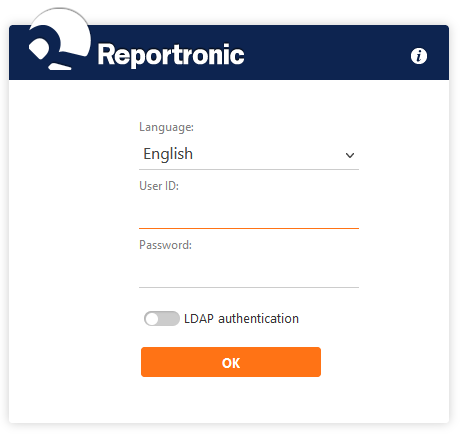
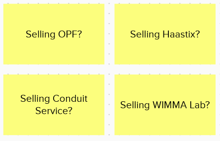
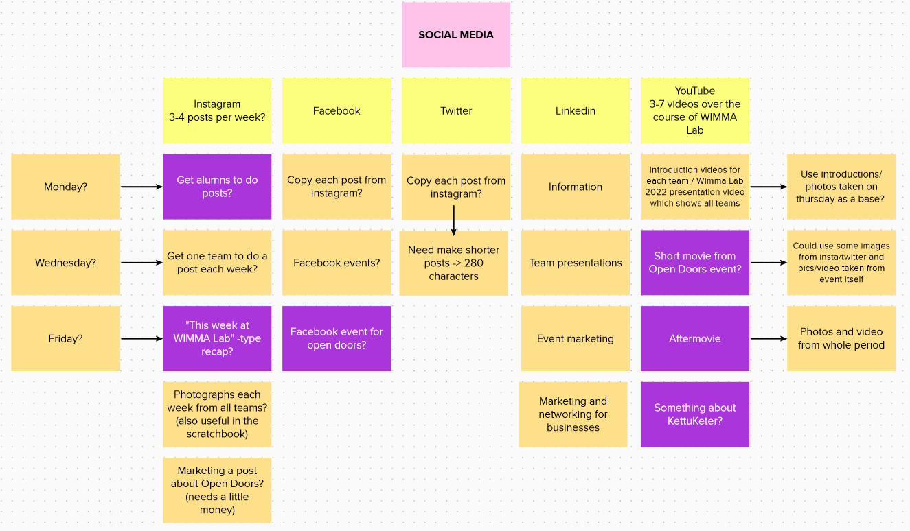
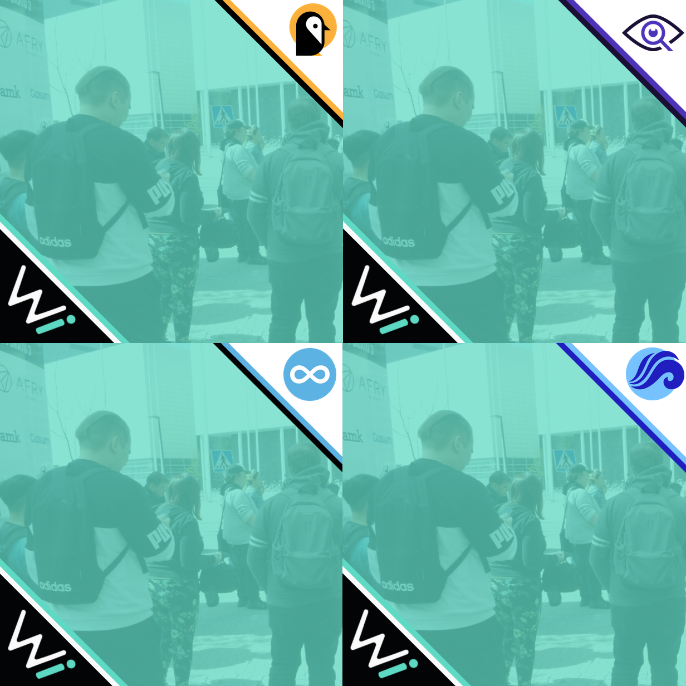

# Sprint 00

|Description|Date|Week(s)|
|:-:|:-:|:-:|
|Orientation| 16.05. - 20.05.  |20|

## Scratch book

### First Week

#### 16.05. Monday

First day of Wimma Lab. Met other people at Wimma Lab and got introduced to the history of WIMMA Lab. Got to know our team. Introduction to Reportronic, which is a tool that we use to report our working hours. Set up our office. Moved some furniture, like tables and chairs around to assemble our working stations.

>

#### 17.05. Tuesday

Had visitors from Netum, Pinja and Nodeon. In the morning everyone kept small introductions about themselves for the whole Lab. Introduction to scrum. Started working on LinkedIn profiles.

#### 18.05. Wednesday

We got more information about what our team will do this summer and we looked at what last year's teams did. Introduction to the whole idea of the scrap book. Planned social media content and schedule in Mural. Tried to figure out WIMMA Lab's target groups for later use.

>
>

#### 19.05. Thursday

Filled team and product canvases. Members started focusing on different things like making filters for social media and 3D logo for Wimma Lab. We got to know our camera equipment. We took people's personal and team pictures. Planned a bit about tomorrow's social media posts. We tested Haastix and learned what was life buoy and some team members learned how to take pictures with a proper camera.

>

#### 20.05. Friday

Team started to work on social media accounts. We made a [Linktree](https://linktr.ee/wimmalab) for WIMMA Lab. We published our first social media posts. We started to look at the OPF-frame and during the afternoon we had a social engineering lecture which was really interesting. We learned how hackers think and how people can use human instinct against us or get us to buy something we don't really need.
