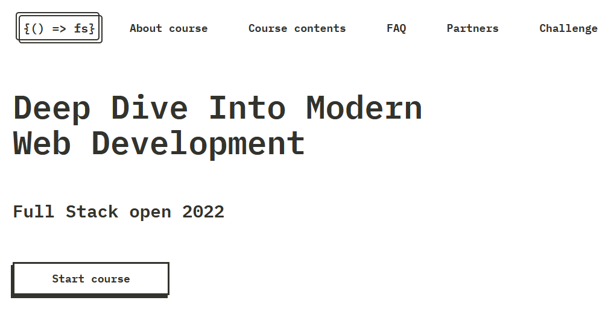
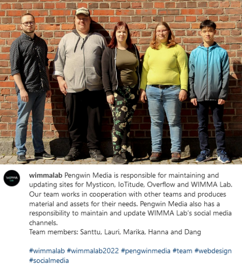
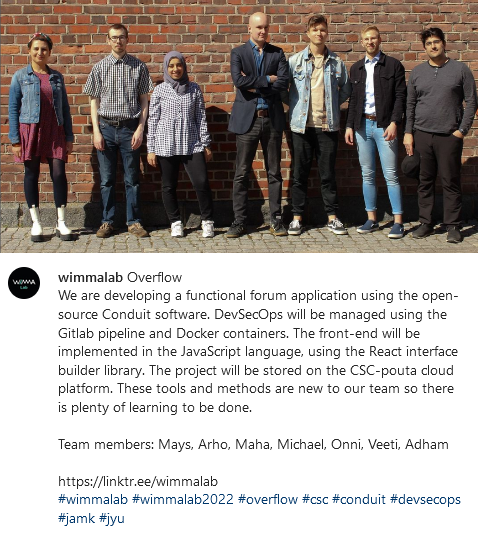
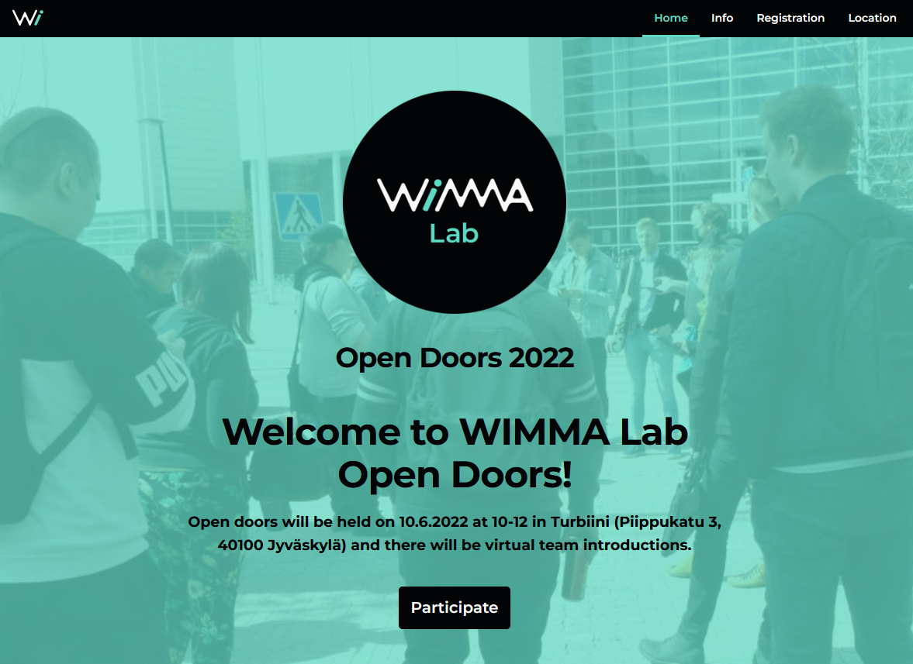
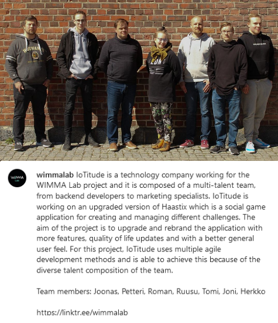

# Sprint 01

|Description|Date|Week(s)|
|:-:|:-:|:-:|
|Studying and working on OPF| 23.05. - 27.05.  |21|

## Scratch book

### First Week

#### 23.05 Monday

Team started to learn React, some worked on Wimma Lab PowerPoint and modified the last photos that we took last week. The team continued modifying the OPF-site. We learned that if you want to make a link, don't leave a gap between [Text for the link] and (where the link goes).  
We started doing the Full Stack Open 2022 course and began to work with Iotitude to redesign Haastix. Started doing Gitlab [Issues](https://gitlab.labranet.jamk.fi/wimma-lab-2022/pengwin-media/core/-/issues?sort=created_date&state=opened) and [Backlog](https://gitlab.labranet.jamk.fi/wimma-lab-2022/pengwin-media/core/-/issues?sort=created_date&state=opened&label_name[]=Backlog).

>

#### 24.05 Tuesday

Continued to work with OPF and managed to create many folders while only trying to rename a folder. Trying to find where to get core to take information from the new folder. After asking for some help, it was found under mkdocs.yml.  
Learned more about vector graphics and started making first versions of the new graphics for Haastix. Also did small posters for every team's office. We had Telia's lecture where we learned about SOC. We posted the first team introduction to Wimma lab's social media channels (Pengwin Media). Did social media posts to LinkedIn, IG, Facebook e.g.

>

#### 25.05 Wednesday

Posted Overflow team introduction to social media. Started to learn Gimp. Had Elisa's lecture and Nordcode's lecture. Continued to work with OPF-site. Some members are learning React.

>

#### 26.05 Thursday

Day off!

#### 27.05 Friday

Making Open Doors website. Released IoTitude team introduction social media posts. Team had a weekly end scrum.

>
>
