# Sprint 02

|Description|Date|Week(s)|
|:-:|:-:|:-:|
|Open Doors marketing & Haastix redesign| 30.05. - 03.06.  |22|

## Scratch book

### 30.05 Monday

Continued to work with open doors website and tried get the main picture done with Gimp, but it didn't go well so our team leader made it.  Got the new Haastix color palette approved. Added Mysticons introduction to social medias. Team members were working on open doors website, Haastix logo, OPF-frame, open day video, team websites and React.

>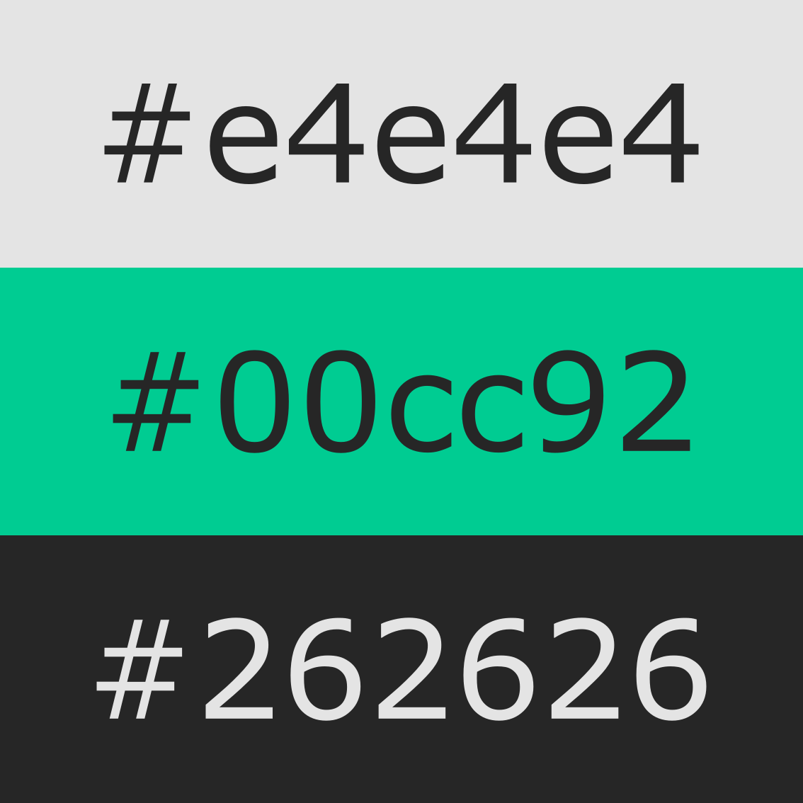
>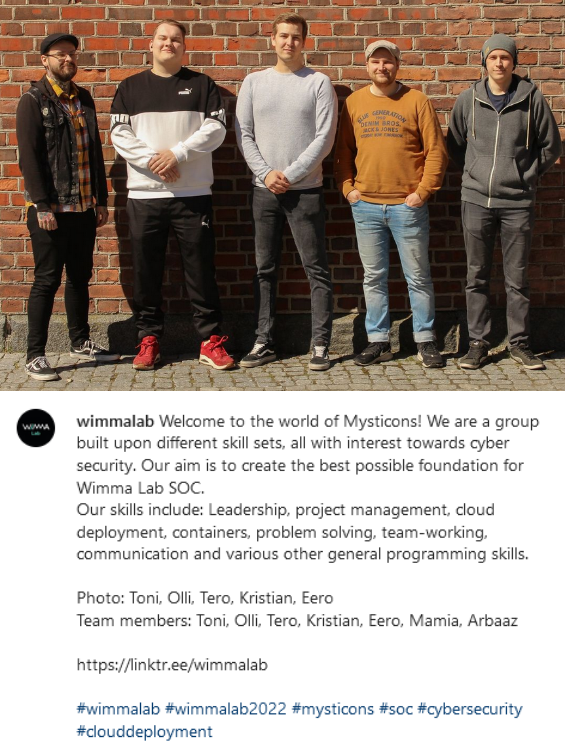

### 31.05 Tuesday

We had Joel Aalto's thesis lecture. Worked on Open Doors website and planned a bit where the guide signs would go. Had problems when trying to add embedded google maps to the website since scalable map would have needed a google API key what requested a phone number so we couldn't do it. Then tried modifying the inner code width but it didn't work (in the end it was working when code was taken from google maps), tried to add it to the SCC as well, but it didn't work either. And tried to add SCC for it but it didn't work. Translated all social media descriptions to English. Did some graphics for Open Doors event and continued logo design for Haastix.

>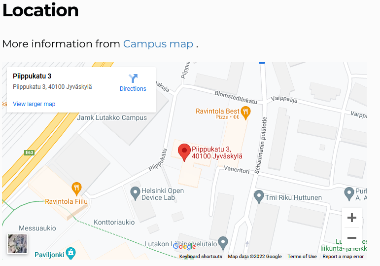
>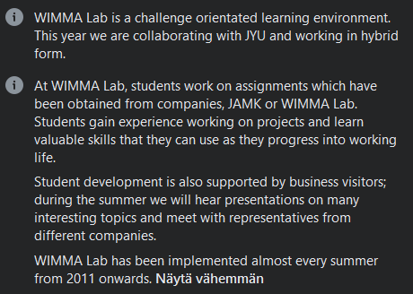
>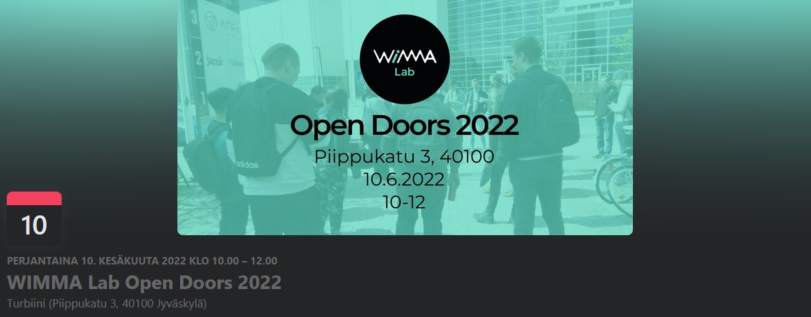
>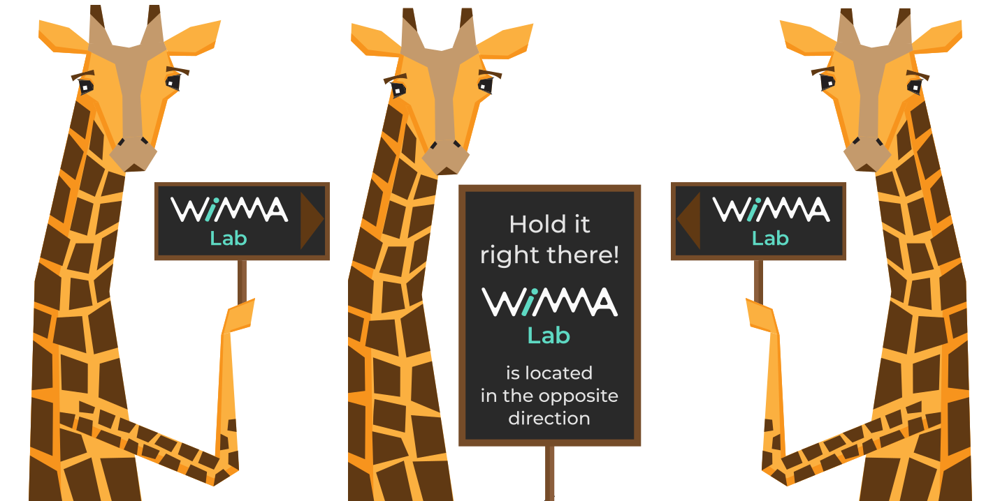
>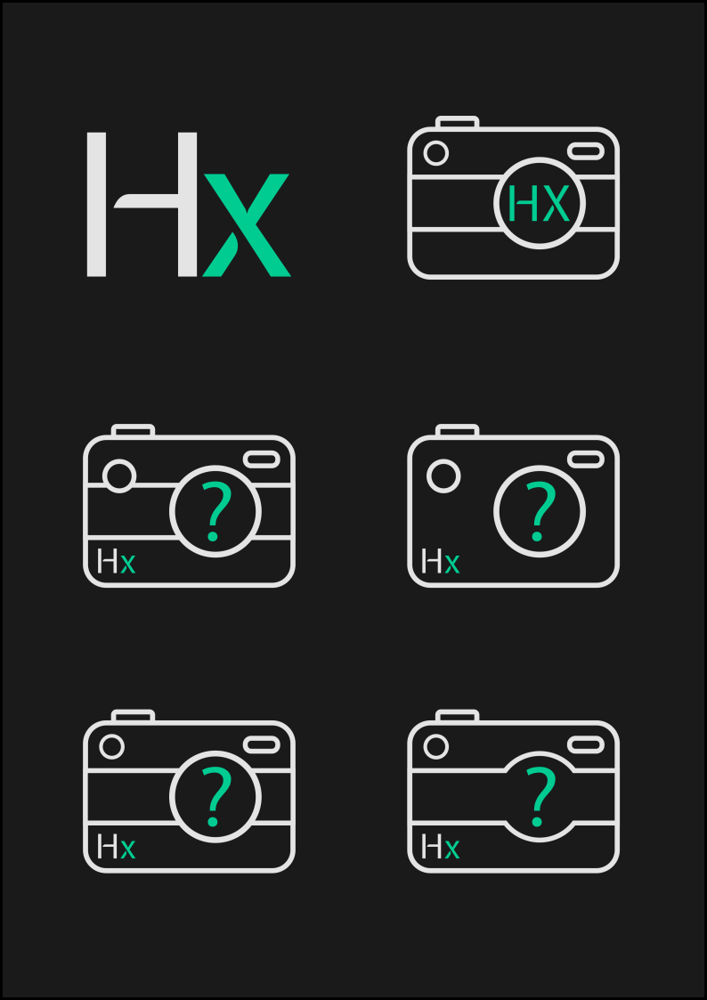

### 01.06 Wednesday

Team continued with open doors website and video, Team websites, OPF and other running tasks. Team leader took the last personal pictures from Mysticons members. Fixed the open doors event website's example picture cutting the button. We made Open Doors event marketing post to LinkedIn. Sami Lindgren had an awesome lecture about test automation, we learned lots of new things and how useful automation actually is. Started sketching new player icons for Haastix and learned how to do shadowing with Inkscape.

>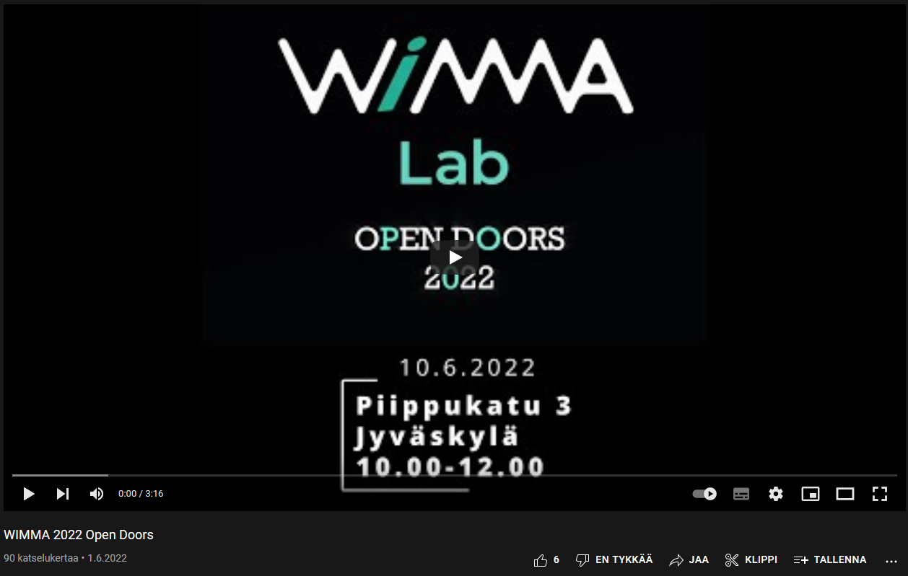

### 02.06 Thursday

We got coffeeee! Our team member did an awesome box opening video. Continued working on the websites. We had Mika Korhonen talking with us about different topics: salary, how behave in work interviews, what kind of person gets the work, how to connect with people and how to do virtual interviews. First logo designs were scrapped and we had a design workshop for a completely new logo. The [new visuals for Haastix](https://wimma-lab-2022.pages.labranet.jamk.fi/pengwin-media/core/03-Design/haastix-redesign/) were complete during this day.

>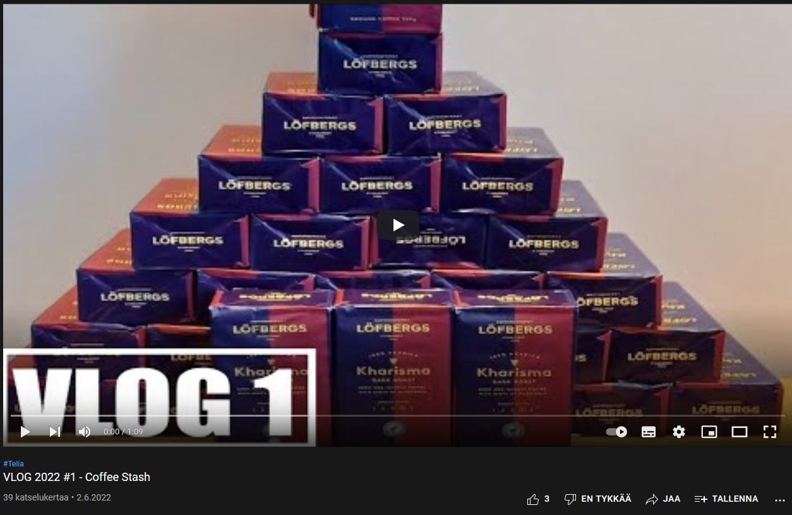
>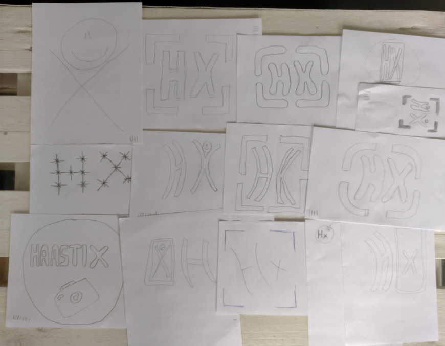
>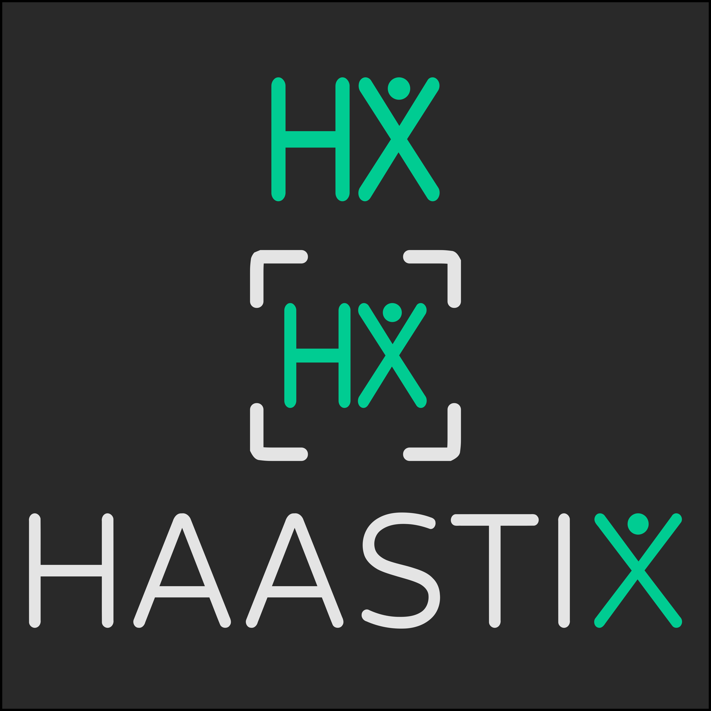

### 03.06 Friday

Had sprint review. Worked on Open Doors website, added the speakers' pictures and adjusted their positions. We needed to modify the assignment part because there was some wrong information. Moved the speakers' pictures to the left side of the page. Updated LinkedIn. Chanded the default OPF colors. Started to work on wimmalab.org.
