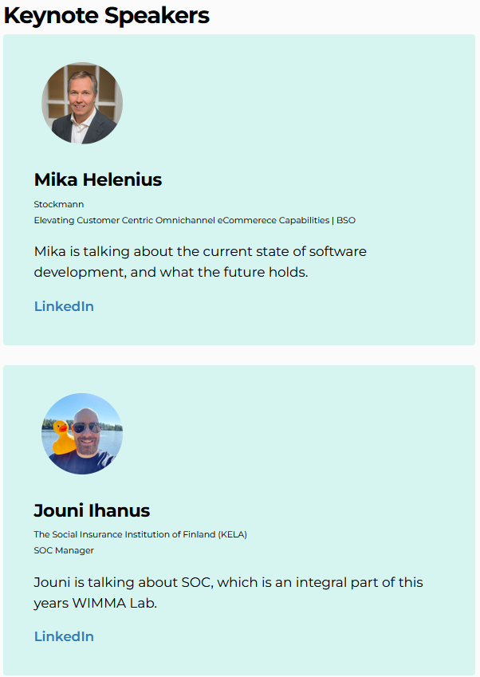
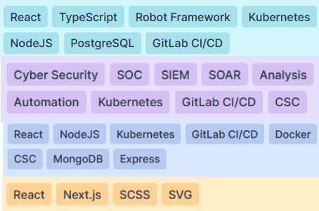
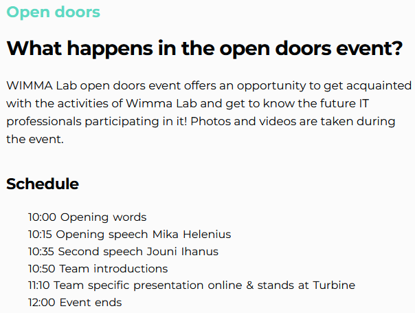
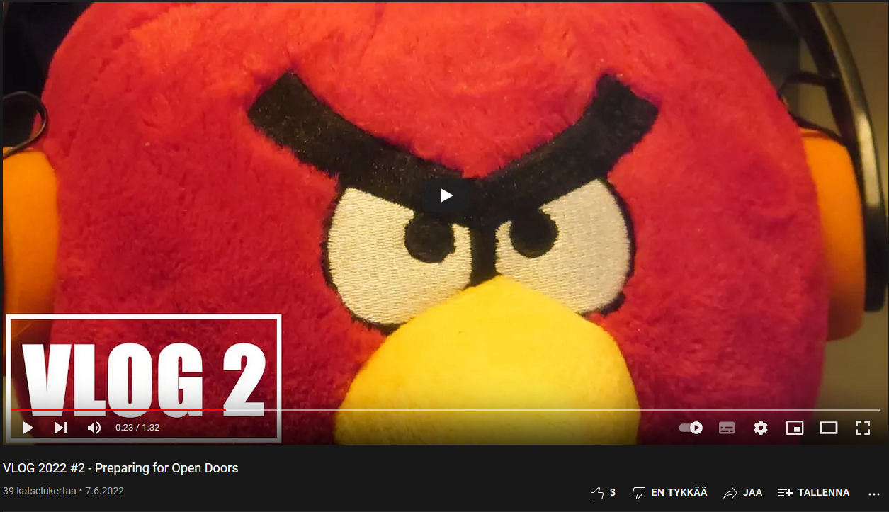
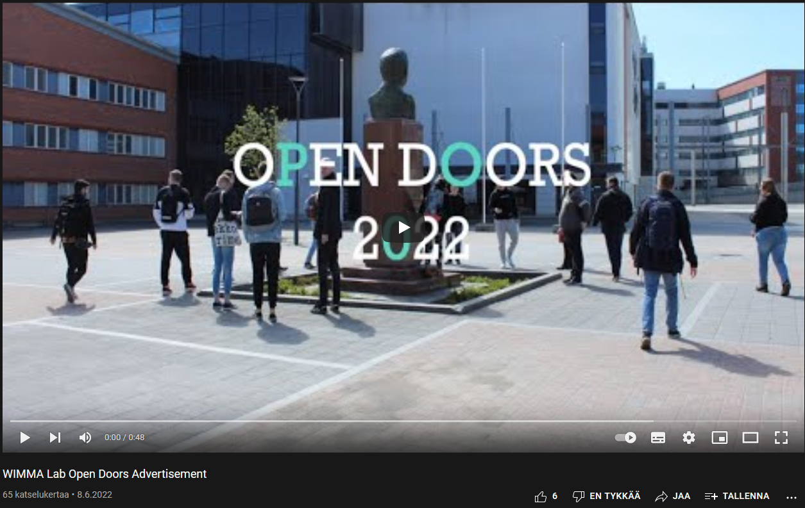
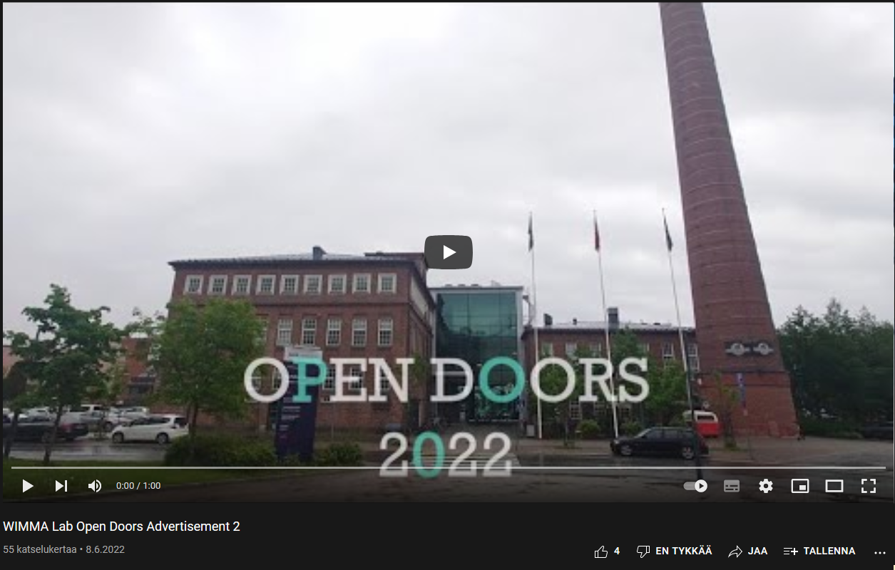

# Sprint 03

|Description|Date|Week(s)|
|:-:|:-:|:-:|
|Open Doors| 06.06. - 10.06.  |23|

## Scratch book

### First Week

#### 06.06 Monday

We added the speakers' part to the Open Doors website and fixed it to look good. We updated Overflow team introduction and went through all team stacks. Started doing LinkedIn summary and planned elevator pitch. Updated team introductions to wimmalab.org website.
We compressed images for better load times on the web and our team member acted as the deputy team leader for the day.

* [IoTitude team page](https://www.wimmalab.org/iotitude)
* [Mysticons team page](https://www.wimmalab.org/mysticons)
* [Overflow team page](https://www.wimmalab.org/overflow)
* [Pengwin team page](https://www.wimmalab.org/pengwin)

>
>

#### 07.06 Tuesday

We filmed material for the Open Doors website video. Added schedule to the website. We updated our LinkedIn profiles and prepared to do the elevator pitch. We continued working on the wimmalab.org website and learning React. Released second vlog.

* [VLOG 2022 #2 - Preparing for Open Doors](https://youtu.be/OiZqYT5u8U0)

>
>

#### 08.06 Wednesday

We fixed the schedule part in Open Doors website and added a link to open in another tab on Open Doors link. Fixed some paddings on speakers' part in Open Doors website. Practiced team introduction with another team leader. Team member finished [Haastix redesign documentation](https://wimma-lab-2022.pages.labranet.jamk.fi/pengwin-media/core/03-Design/haastix-redesign/) and fixed some locale issues with the website. Uploaded Open Doors advertisements to youtube.

* [WIMMA Lab Open Doors Advertisement](https://youtu.be/OG9A6RJ7574)
* [WIMMA Lab Open Doors Advertisement 2](https://youtu.be/fHhLNRmbV0g)

>
>

#### 09.06 Thursday

Team member modified the picture of Jouni Ihanus and asked his opinion if the picture was as he wanted it to be. After confirmation, they updated it to the Open Doors website. Then we planned where we put the guide signs on Friday. We had team introduction rehearsals, but we ended up changing the PowerPoint presentation. Cleaned the office for Friday. Team members planned WIMMA Lab branding and finished up PowerPoint presentation for Open Doors. Uploaded third vlog 3 to YouTube which was about the teams stressing about Open Doors event.

* [VLOG 2022 #3 - Day before](https://youtu.be/OiZqYT5u8U0)

#### 10.06 Friday

Open doors event!
We put the signs in places in the morning. Finished the PowerPoint presentation, ordered people to make coffee and put up cookies and other snacks for visitors to eat. Stood at the stand and represented the team, while one team member held the PowerPoint presentation.
