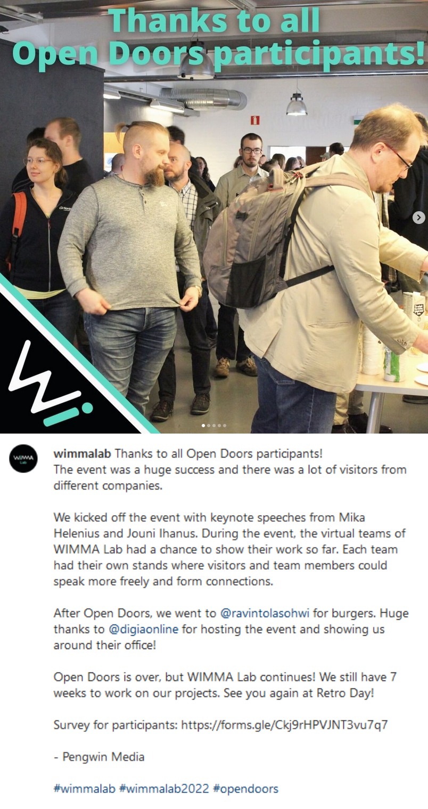
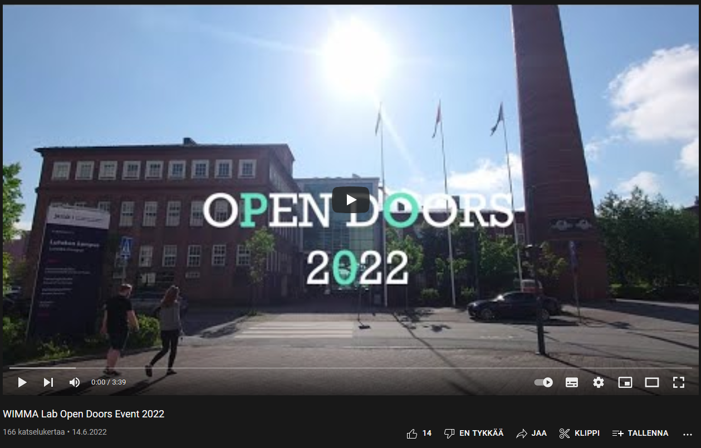

# Sprint 04

|Description|Date|Week(s)|
|:-:|:-:|:-:|
| Planning & studying | 13.06. - 24.06.  |24-25|

## Scratch book

### First Week

#### 13.06 Monday

Switched team leader. Did a thank you post from Open Doors.
Team members fixed validation errors on the Open Doors website. Fixed issue boards and learned some new GitLab features.

>

#### 14.06 Tuesday

Planned the After Lab and team members did the documentation about [updating the Open Doors website](https://wimma-lab-2022.pages.labranet.jamk.fi/pengwin-media/core/04-Documentation/opendoors-website/). Started working on social media documentation and branding strategy. Thank you video from Open Doors was published and better thank you social media posts were made.

>

#### 15.06 Wednesday

Team studied React, worked on wimmalab.org and edited our communication plan. Looked into the possibility to create a Minecraft server and in the end created it. Finalized the first version of our [social media plan](https://wimma-lab-2022.pages.labranet.jamk.fi/pengwin-media/core/02-Project-management/social-media-plan/). Studied branding and made a frame for branding strategy.

#### 16.06 Thursday

We were brainstorming about different things to create or to arrange (e.g. WIMMA font, WIMMA camp). Planned brand perception survey according to our branding strategy. Studied Robot Framework. Added white listing to Minecraft server. Continued to learn React.
Started planning out the Team Interviews 2022 project, which is about making recorded interviews with the teams about WIMMA Lab and studies in general, which then are to be put into YouTube. Mysticons interview was done 4 times today.

#### 17.06 Friday

Team members continued planning the brand perception survey, learned React, worked on wimmalab.org, did team interviews, updated OPF current status and watched a webinar about open source code.
Then we had visitors Sergey Martikainen and Mikko Saarenpää from Elisa and Mikko Kuljukka and Jouni Näätänen from Palo Alto Networks.
After suggestion that maybe we could do the Team Interviews in a room and not in the hallway, the Mysticons interview was recorded yet again.
Also, IoTitude's and Pengwin's interviews was also recorded today.
[Visitors LinkedIn post](https://www.linkedin.com/posts/wimmalab_paloaltonetworks-elisa-wimmalab-activity-6944971834186473473-lBna?utm_source=linkedin_share&utm_medium=member_desktop_web)

### Second Week

#### 20.06 Monday

We got Robot Framework to work with the help of other team's member. Managed to get Robot Framework to take print screen from Fiilu's menu and save it as picture. Tested to get lunch food as text but did not understand how to save the text. Updated last Friday to status in OPF. Completed branding strategy.  Doing social media stuff, learning Illustrator, doing logos.
Overflow's recording was done today, and IoTitude's and Pengwin's interviews were reshooted. Also Eliel's Student Coach interview was done today.

#### 21.06 Tuesday

Continue with Robot Framework. Managed to figure out how to get Robot Framework to press buttons what are not buttons. Learning Adobe Illustrator and React.
Team Interviews shoots are now completed, and it will go into editing phase. After the laptop melting down due to too much material being edited at the same time, the editing will be done remotely.

#### 22.06 Wednesday

Two of the team members studied React. Had Nodeon's lecture. Team did interview videos and studied Illustrator.
Team Interviews 2022 videos are being edited overtime.

#### 23.06 Thursday

Team continued to study React and Illustrator and we watched Palo Alto Network's Panel. Doing social media stuff.
Team Interviews 2022 videos are being edited by night and day.

#### 24.06 Friday

Mid Summer!
