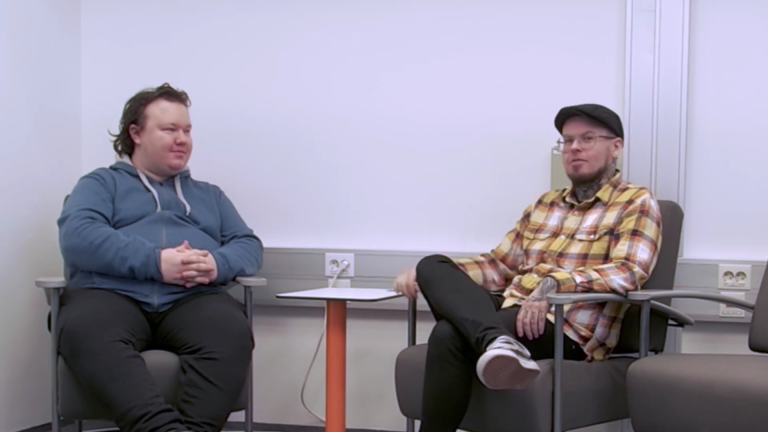
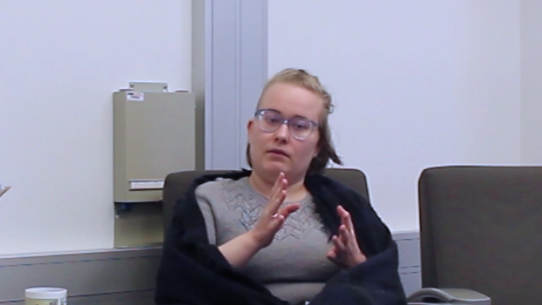

# Sprint 05

|Description|Date|Week(s)|
|:-:|:-:|:-:|
|Interviews & studying| 27.06. - 08.07.  |26-27|

## Scratch book

### First Week

#### 27.06 Monday

Our team's social media week so planning what to post, sprint changed so we got new tasks.
Team Interviews 2022 editing is nearing it's end, but there is still some more editing to be done, mainly fixing some errors. We reviewed them all with the whole team, and took notice of errors and wrote them down.

>

#### 28.06 Tuesday

Team studying React and Adobe Illustrator.
Team Interviews 2022 editing continues.

#### 29.06 Wednesday

Had Nodeon's CV workshop.Team studying React and Adobe Illustrator. Doing social media posting.
Team Interviews 2022 editing continues.

#### 30.06 Thursday

We had Nortic Talent Esa Launi's lecture where he answered our questions about working in IT.Studying Design Learning.
Team Interviews 2022 project has now been completed and today we released the first part of it, the Mysticons interview.
>

#### 01.07 Friday

Woolman talked about their company and what they do. Doing Wordpress-project.

>[LinkedIn post 27.6-1.7.](https://www.linkedin.com/feed/update/urn:li:activity:6949616379138330624)

### Second Week

#### 04.07 Monday

Took some new photos. Did read information about customer Wodpress-website project. Learning React and Illustrator.
>

#### 05.07 Tuesday

We did get customer Wordpress project and we did first mockups for it and had a meeting what was good in everyone's mockups and what to improve for next ones.
Team Interviews 2022 IoTitude episode release today.
>

#### 06.07 Wednesday

We did do second mockups for the customer Wordpress-website project and had visitor from Siili Solutions.

#### 07.07 Thursday

Team members started to learn WordPress with Metropolia's class.

#### 08.07 Friday

Continued from Wordpress project. Doing Docker and learning Wordpress.
