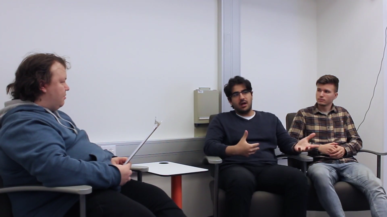
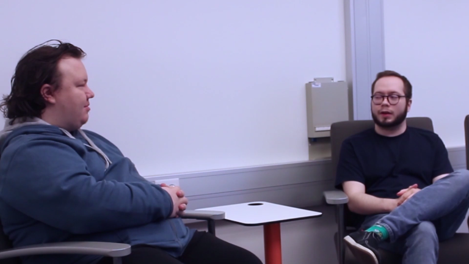

# Sprint 06

|Description|Date|Week(s)|
|:-:|:-:|:-:|
|Project Vodka & studying| 11.07. - 22.07.  |28-29|

## Scratch book

### First Week

#### 11.07 Monday

Doing social media stuff,doing Forum documenting and learning Wordpress.
Team Interviews 2022 Overflow episode is published today.
>

>

>[Overflow WIMMA Lab forum](https://gitlab.labranet.jamk.fi/wimma-lab-2022/pengwin-media/core/-/raw/master/documents/03-Design/WIMMA%20Lab%20Forum%20banner-%20and%20logodesign.md?inline=false)

#### 12.07 Tuesday

Team is doing social media postings and learning WordPress for Turku Distillery project.

#### 13.07 Wednesday

Team members looked at how to use Elementor in WordPress and looked for more tips for WordPress.
>

#### 14.07 Thursday

Started properly working with customer projects footer and learning more Wordpress. Some team members are learning React.

#### 15.07 Friday

Today we had two meetings about the customer project. learning and doing more Wordpress-website. Pengwin Interview video editing is nearing completion, it is projected to be released on next Monday.

### Second Week

#### 18.07 Monday

Doing social media stuff, doing MystiSOC-logo design and doing Wordpress-website, while also doing documentation. Made an Instagram post for IoTitude.
Team Interviews 2022 Pengwin episode is published today.
>

>

>[MystiSOC logodesign](https://gitlab.labranet.jamk.fi/wimma-lab-2022/pengwin-media/core/-/raw/master/documents/03-Design/MystiSOC-logodesign.md?inline=false)

#### 19.07 Tuesday

One team member was working on customer projects footer in projects WP. Team is learning WordPress and React.

#### 20.07 Wednesday

Team is being busy working on Turku Distillery WordPress site, and some members are learning React. Team has lamented the missing feature in Elementor, that you cannot edit the CSS files by hand, which has caused a little slowdown on things and heated some nerves.

#### 21.07 Thursday

Final fixes are being made with Eliel Interview video, so that it can be released the next day. Turku Distillery WordPress site development continues. Team Interviews Bloopers Reel video editing begins, which was planned during the Pengwin Team Interviews.

#### 22.07 Friday

The final part of the Team Interviews 2022 episodes is released today, the special Student Coach interview, where Lauri and Eliel talked about what it is like to be a Student Coach in WIMMA Lab, what tasks it includes and how he found out about WIMMA Lab and how it impacted Eliel's studies. The editing of Team Interviews 2022 Blooper reel continues at timely manner.
>
