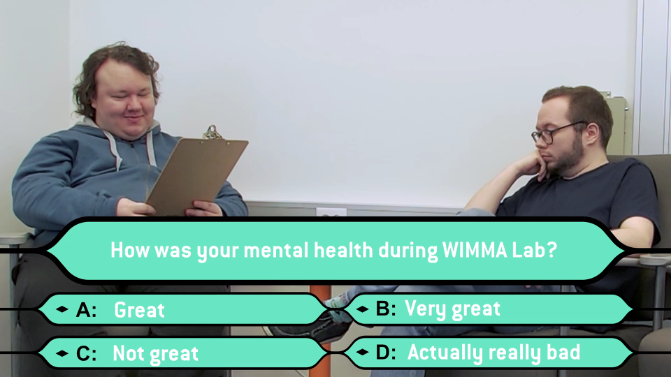

# Sprint 07

|Description|Date|Week(s)|
|:-:|:-:|:-:|
|Final Week| 25.07. - 29.07.  |30|

## Scratch book

### Final Week

#### 25.07 Monday

Team is working on the Turku Distillery project, the editing of Team Interviews 2022 Bloopers Reel finishes today, after being reviewed by the rest of the team, and some mistakes were spotted and will be fixed later today, so the video can be released tomorrow.

#### 26.07 Tuesday

There was a visitation from Pinja, where they were going around the WIMMA Lab offices and getting to know what kind of projects we have been doing all this summer. We discussed our work and projects, like how we have been making the Turku Distillery WordPress site, Lauri has been busy making content to YouTube, Marika keeping the social media channels open.
Team Interviews 2022 special bloopers reel was published today to WIMMA Lab YouTube channel, which includes several failed takes and some jokes.
>

#### 27.07 Wednesday

Jouni Ihanus and Henrik Burtsov came from Kela to discuss Cybersecurity with us, and talking about what it's like to work in Kela. Work on updating the current statuses continues, and work on Turku Distillery WordPress continues also.

#### 28.07 Thursday

Project Vodka handover.

#### 29.07 Friday

Cleaning up the office.
