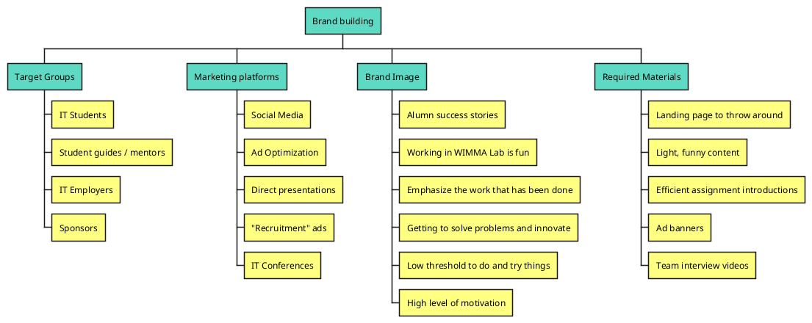
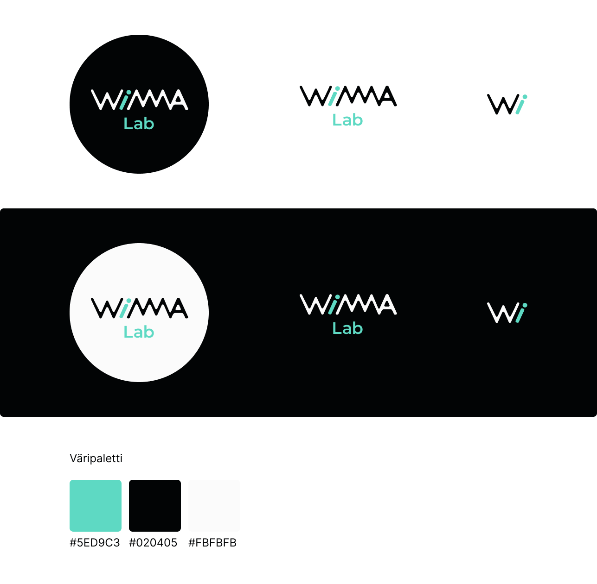
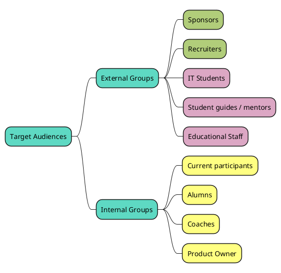

# Branding Strategy

|  |  |
|:-:|:-:|
| Document | Branding Strategy |
| Author: | Santtu Korpisalo|
| Version: | 1.1 |
| Date: | 14.07.2022 |

## Introduction

The purpose of branding is to increase reputation and visibility. 
Brand is a set of interconnected things and is never completely under the brand owner's control, but some brand related assets are. These assets are a tool to communicate the brand to the outside world.

This strategy is a way of figuring out the true brand of WIMMA Lab and
finding new ways of utilizing the branding assets to communicate it to the outside world.

Having a stronger brand is a very valuable asset considering 
WIMMA Lab's future and attracting more sponsors and participants.

Last year, Pengwin Media 2021 started doing the ground work on WIMMA Lab branding by creating a new visual outlook for WIMMA Lab and all it's virtual teams. This year, Pengwin 2022 starts to work on all the other brand-related tasks. Before writing this document, we gathered some general ideas:

Pengwin 2021 work:

Unlike branding generally, WIMMA Lab's brand building is not focused on generating profit, but to increase it's attraction and reputation. We have gathered some keypoints to serve this purpose, these include:

| Marketing Term        | Description |
|:-:|:-:|
| Perception            | How WIMMA Lab is viewed in people's minds. This can not be directly determined. |
| Promise               | WIMMA Lab's mission statement and values. Delivering the promise consistently so it will not affect our reputation.|
| Visibility            | WIMMA Lab is seen in medias and marketing platforms. |
| Advocacy              | Participants and alumns continue to recommend WIMMA Lab because of their positive experiences. |

## Target Audiences

For efficient branding, a clear target audience has to be defined. Trying to do perception research about a brand by asking everyone's opinion would lead to masses of useless data. After all, brands are *something for someone* and not *everything for everyone*.

WIMMA Lab's target audiences are quite different from any other brand. The big image is that we want to be seen by educational facilities and IT companies. 

Also, to build understanding about WIMMA Lab's brand, we also need internal perception. This is basically everyone who has participated in WIMMA Lab in any role.

These audiences are still quite broad, so we narrowed them down a bit more. This section can be divided into two smaller groups; external groups and internal groups.
WIMMA Lab's external groups build the perception of all non-participants. 

## Brand Research

The first step in strengthening WIMMA Lab's brand perception is to conduct surveys to all of the groups mentioned above. The results of these surveys will be carefully examined to determine if WIMMA Lab is perceived in the same way by everyone. If it is not, then the brand is inconsistent and should be fixed in the later steps.

The usual mistake brand-owners make is that they assume they understand their target audiences. After all, only the brand-related assets are under their control, not the actual brand. With brand perception research, WIMMA Lab's brand will be formed.

Different surveys will be made for the following groups:

  * Current Participants
  * Alumns
  * Coaches & Product Owner(s)
  * IT Students (Non-Participants)
  * IT Recruiters & Sponsors

## Brand Improvement

Brand promise is something that should be defined as accurately as possible. Promises and reputation go hand in hand and not delivering on giving promises will affect a brand's reputation negatively.

With brand perception research data, it should be clear what WIMMA Lab is and what it's true value *(brand promise)* is to all the target audiences. The real question is *how* do we utilize our assets into delivering this message. 

Essentially, the goal here is to create something so impactful it doesn't go unseen. As mentioned before, we are improving *visibility* and *reputation*, and our assets should serve that purpose. One mentionable thing is the *halo effect*, in which one positive impression made by a company will influence the overall impression.

## Marketing

This phase is the implementation of the strategy. When going through this phase, it is important to track the plan and the result. As marketing is as abstract it is at this point, this section will be updated later. Here are a few questions to help get started:

  * How to demonstrate WIMMA Lab's reputation?
  * How to increase WIMMA Lab's visibility?
  * How to utilize existing assets and platforms?
  * Any new assets or platforms?

