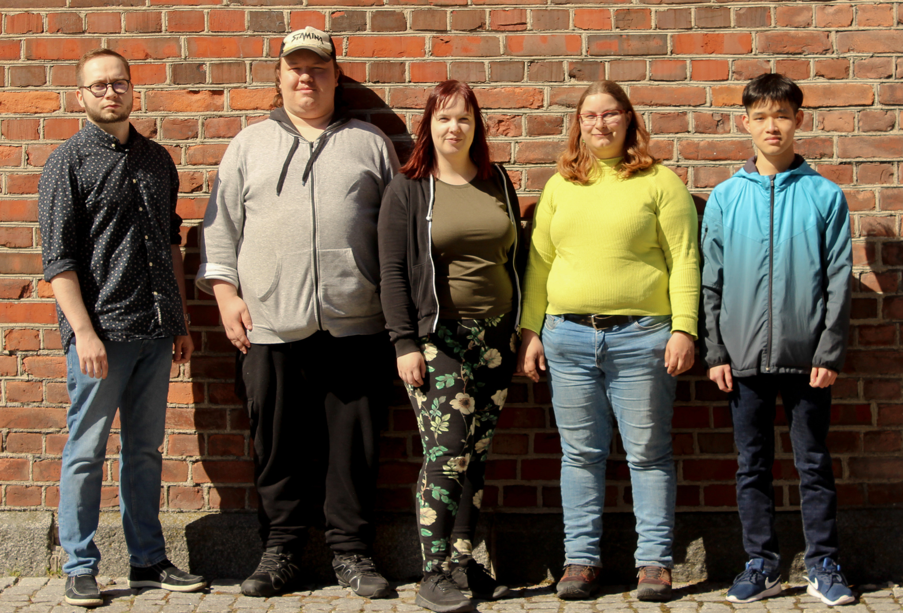

# Team Introduction

Pengwin Media is responsible for maintaining and updating sites for Mysticon, IoTitude, Overflow and WIMMA Lab. Our team works in cooperation with other virtual companies (Mysticon, IoTitude, Overflow) and produces material and assets for their needs. Pengwin Media also has a responsibility to maintain and update WIMMA Lab's social media channels.

## Team members

| Name | Title | Link |
|:-:|:-:|:-:|
| Santtu Korpisalo | Team Leader / Graphic Designer | [LinkedIn](https://www.linkedin.com/in/santtu-korpisalo/) |
| Lauri Kuuva | Media Producer | [LinkedIn](https://www.linkedin.com/in/lauri-kuuva-149440170/) |
| Marika Matalamäki | Media Producer / Communications | [LinkedIn](https://www.linkedin.com/in/marika-matalamaki/) |
| Hanna Salminen | Junior Web Developer | [LinkedIn](https://www.linkedin.com/in/hanna-pauliina-salminen/) |
| Dang Le | Junior Web Developer | [LinkedIn](https://www.linkedin.com/in/dang-nguyen-le/) |

## Picture of the team

