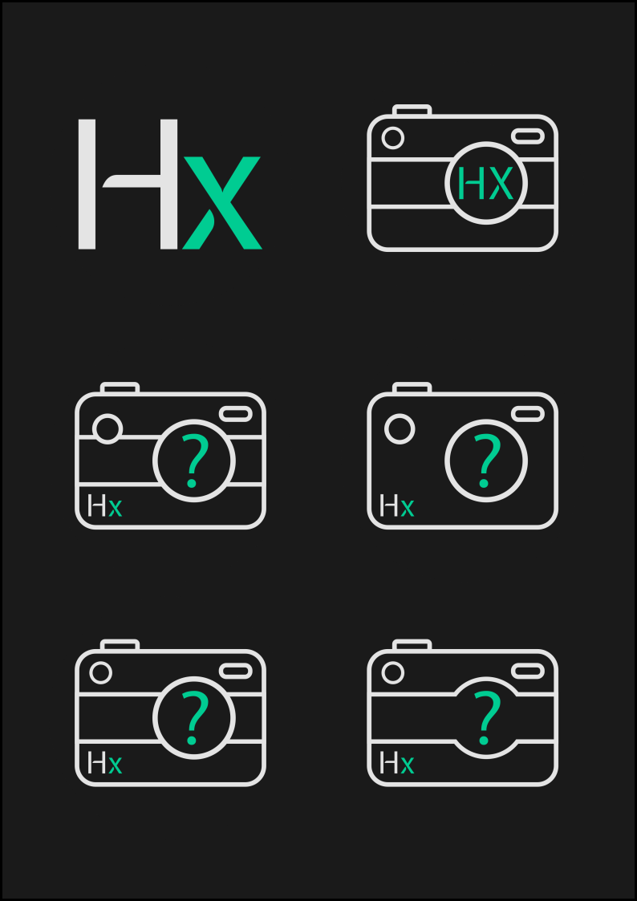
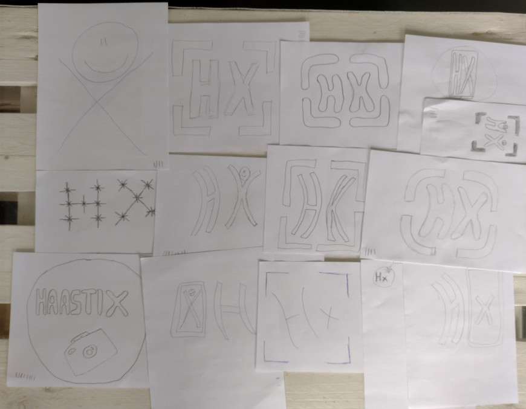
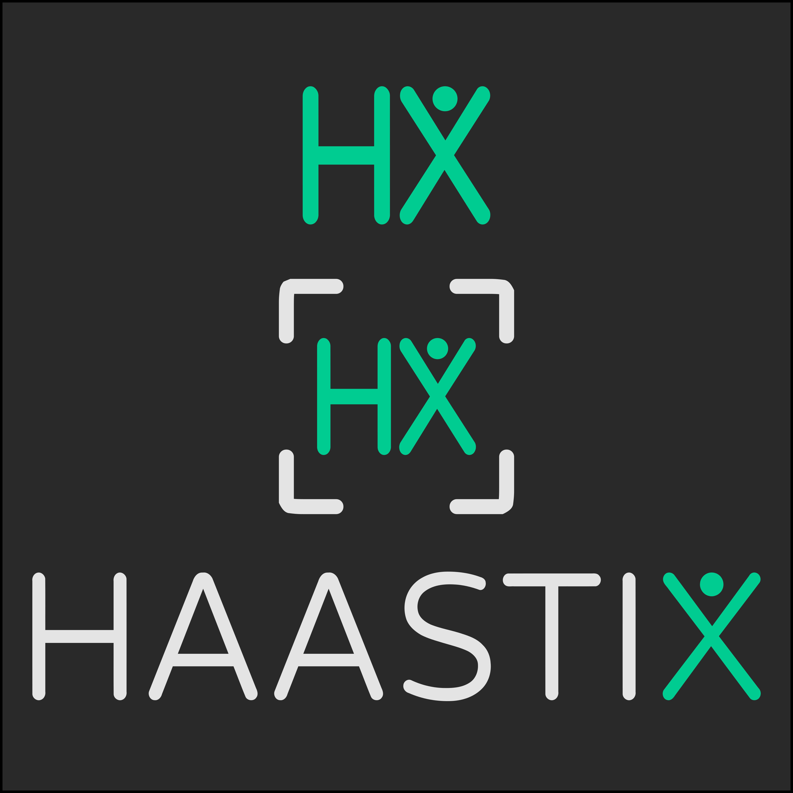

# Haastix Redesign

## Background

Haastix is a mobile game originally created in WIMMA Lab 2021. In 2022, IoTitude's assignment is to update Haastix. 
Pengwin Media worked in collaboration with IoTitude to redesign the visual outlook of the game.

## Logo

### First logo versions

The first task of logo design was to create a new banner. This was done by creating multiple versions and letting IoTitude decide what design to pursue. The colors were picked with a high contrast in mind but soften it up a bit. The green color was added to liven the palette up a bit. 

Finally, Expletus Sans was picked. The font was slightly altered into a few versions.

The next step was to create the actual logo. Quite a few ideas came up during a small meeting with IoTitude. It was decided that the logo would be a camera.

Eventually, all of these designs were scrapped as it was pointed out that they are too detailed and would not scale well.

### Second logo versions

Back to the drawing board, we had a logo design workshop. We had participants from multiple teams and we used a logo designing method from a book called Lean UX. First, we had to figure out what the target groups are and what is the underlying feel that the logo would cause. The idea was to create a more joyful logo.

The next step was that everyone drew their idea for the new logo. After that, the best three were picked by voting. After that, everyone drew new version combining ideas from the previous vote. 

Pengwin Media took all the ideas and made few version and did slight adjustments based on IoTitude's wishes. The first idea was to add movement to the logo, which sparked an idea that the X could look like a stick figure jumping. The other idea was to add a focus frame around the logo, which represent the core gameplay.

### Final logo

The final logo, icon and banner:

### Fonts

[Varela Round](https://fonts.google.com/specimen/Varela+Round)
 
  * Regular 400

The font in the logo is slightly altered by stretching and modifying the default letter spacing.

### Colors

Green for text

  * HEX #00CC92
  * CMYK 100, 0, 28, 20

White for focus frame

  * HEX #E4E4E4
  * CMYK 0, 0, 0, 11
