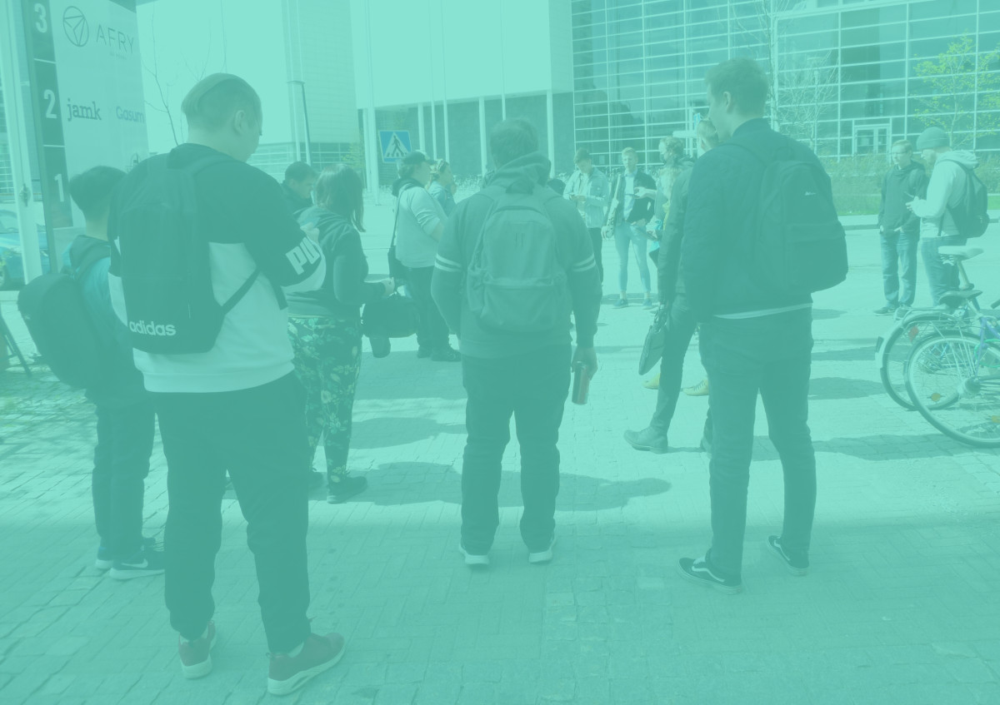
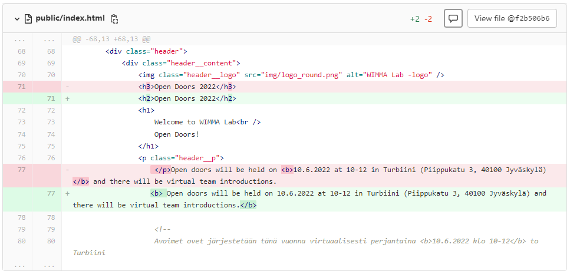

# Editing open doors website

## Start

Last year's Open Doors repository was forked into a new one.

Starting situation:

* [Open Doors HTML 2021](../assets/opendoors2022/opendoors2021file.css)
* [Open Doors CSS 2021](../assets/opendoors2022/opendoors2021.css)

First, last year's pictures were removed and a new banner picture and team logos were added.

Then the Finnish sections were translated into English and then each team's stacks were edited.
Next font sizes, headers size and banner picture was edited.

Changed HTML lang to en and removed commented Finnish original texts.
Edited header_logo max-width to 15em.
Added alt to WIMMA Lab logo and edited IoTitudes introduction.

Then we corrected spelling mistakes.
Speakers section was moved on top of content.

Overflow and IoTitude stacks were corected and Mysticons introduction was edited.
IoTitudes description was edited and added paragraphs for easier reading.

First version of google maps were added.

New navbar link Location was added, header place changed, some typos corrected and campus map was added.

Removed teams website links and modified Mysticons stack. 
Changed min height on header.
Edited header logos width and we pushed the website to avoin.wimmalab.org with Vercel.

Added so that the campus map opened to a new tab and added WIMMA Lab Open Doors link picture.
Edited banner picture to a reasonable size.

Edited speakers section and created class for it.

Then we added Mika Helenius picture and tested picture placement on left side and decided leave them there.
Moved speakers section to another file and added a notification about that pictures will be taken during the event.

## End product

Here is how the HTML and CSS ended up lookking and link to the website

* [Open Doors HTML 2022](../assets/opendoors2022/opendoors2022html.css)
* [Open Doors CSS 2022](../assets/opendoors2022/opendoors2022.css)
* [Website link](https://wimma-lab-2022.pages.labranet.jamk.fi/pengwin-media/avoimetovet-2022/)
